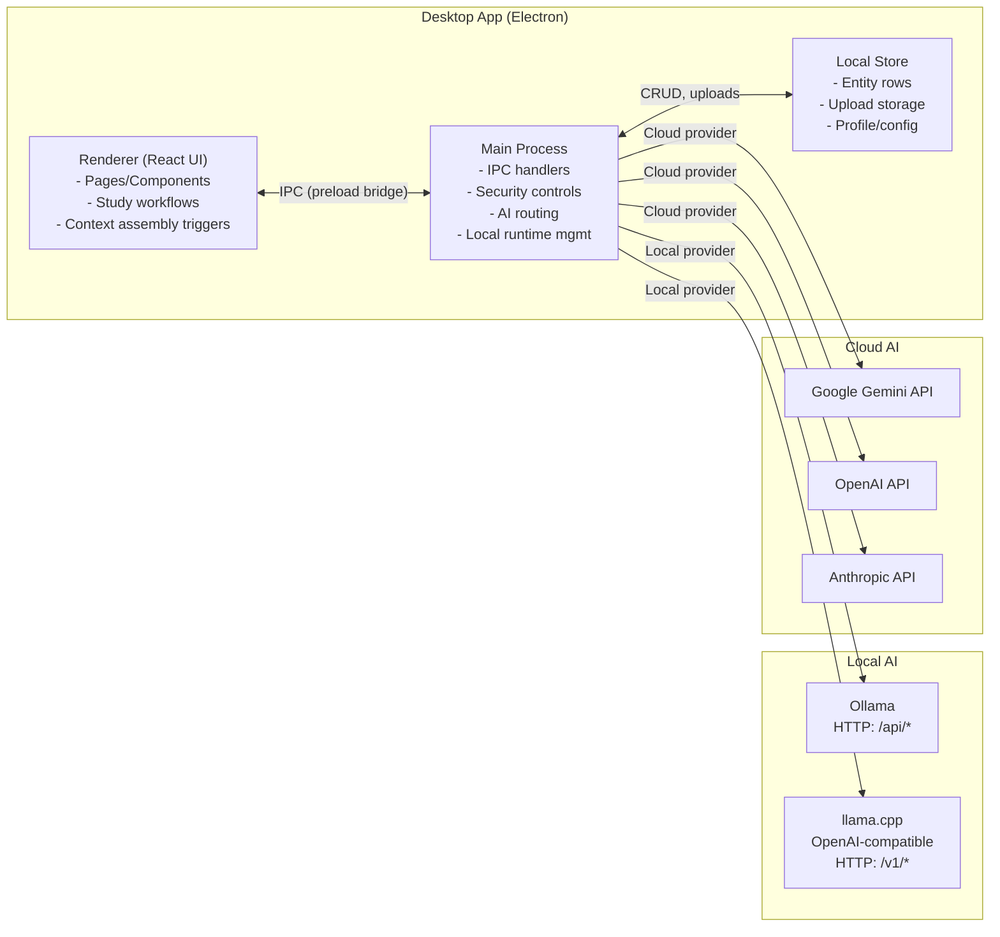

# StudyBridge

StudyBridge is an open-source, local-first AI study companion for students. It keeps courses, uploads, notes, tasks, progress, and AI tutoring in one grounded system instead of scattering them across separate tools.

The app is built for:

- Students who need offline or unstable-internet support
- Students who want one place for materials, notes, progress, and study planning
- Teachers and mentors who want a clear student workflow to evaluate

## What It Does

- AI Tutor with course-aware grounded replies
- Study sessions with summaries, flashcards, quizzes, notes, mind maps, and chat
- Planner with actionable tasks and due-date scheduling
- Library for materials, notes, saved answers, guides, and chats
- Mind map creation, editing, and export
- Review queue with spaced follow-up scheduling
- Desktop local AI via `llama.cpp` or Ollama
- Optional cloud AI with Google, OpenAI, or Anthropic API keys
- Codex CLI mode for desktop OpenAI-backed generation

## How It Works

StudyBridge keeps the app in control of the important parts:

- Course/topic-grounded context assembly
- Source-linked artifact generation
- Explicit write approvals before persistence
- Session, review, and confidence tracking in app state

This lets the app stay:

- Local-first for data ownership
- Verifiable through source links
- Structured for repeatable study workflows

The full student guide lives inside the app at `Docs`.

For provider-specific setup and official references, use the `Official docs` dropdown in `Settings`.

## Architecture

StudyBridge is an Electron desktop app with a React renderer. Data is stored locally and AI calls are routed through the Electron main process to either local runtimes (Ollama/llama.cpp) or cloud providers.



## Desktop

- Windows-only desktop build
- Local AI runs through `llama.cpp` or Ollama
- The app supports local model startup/readiness checks
- Codex CLI and cloud API-key modes are available in Settings

## Official Runtime Docs

- OpenAI Codex CLI: https://help.openai.com/en/articles/11096431-openai-codex-cli-getting-started
- Anthropic Claude Code: https://docs.anthropic.com/en/docs/claude-code/overview
- OpenCode docs: https://opencode.ai/docs
- Google Gemma docs: https://ai.google.dev/gemma/docs/run
- Google Gemini CLI: https://github.com/google-gemini/gemini-cli
- Google Gemini API key docs: https://ai.google.dev/gemini-api/docs/api-key

## Local Setup

```bash
npm install
npm run desktop:dev
```

## Packaging

Build the renderer, then package the desktop app:

```bash
npm run build
npm run desktop:build
```

If Windows packaging fails with symlink privilege errors, run the terminal as Administrator or enable Windows Developer Mode. Electron Builder downloads a signing helper that needs symlink support on Windows.

## AI Modes

StudyBridge supports three main AI paths:

- Codex CLI mode
- Local Gemma through `llama.cpp` or Ollama
- Google, OpenAI, or Anthropic API-key mode

When AI is not configured, the app does not guess. It points the user back to Settings.

## Upload Parsing

StudyBridge extracts and chunks uploaded content so the AI can use the real course text:

- Plain text files
- DOCX
- PPTX
- PDF text layers

Scanned PDFs and image-only uploads do not use OCR yet, so those are weaker unless they contain embedded text.

## Validation

```bash
npm run build
npm run lint
npm run test
```

## License And Liability

StudyBridge is provided as-is, free of charge, without warranty.
Users should evaluate it for their own environment and risk tolerance before relying on it for important academic or production use.
